# ⚠️ IMPORTANT: Start Here!

Before you begin coding, you MUST copy the template files to the src directory:

```bash
# Copy all template files to src directory
cp template/*.py src/

# Verify the files were copied
ls src/
```

The `template/` directory contains starter code with TODO comments showing what you need to implement.
The `src/` directory is where your implementation goes and where tests will look for your code.

---

# Simplified SNMP Protocol Implementation
**CPSC 3600 - Networks and Network Programming**  
**Fall 2025**

---

## 📑 Table of Contents

### Quick References
- [**📊 Grading Information**](GRADING.md) - Specification grading bundles and requirements
- [**🧪 Testing Guide**](TESTING.md) - How to run tests and verify your implementation

### Main Documentation
- [Simplified SNMP Protocol Implementation](#simplified-snmp-protocol-implementation)
  - [📑 Table of Contents](#-table-of-contents)
    - [Quick References](#quick-references)
    - [Main Documentation](#main-documentation)
- [1. Introduction](#1-introduction)
  - [Learning Objectives](#learning-objectives)
  - [Why This Matters](#why-this-matters)
  - [Project Overview](#project-overview)
- [2. Getting Started](#2-getting-started)
  - [Environment Setup](#environment-setup)
    - [Step 1: Verify Python Installation](#step-1-verify-python-installation)
    - [Step 2: Create Virtual Environment (Recommended)](#step-2-create-virtual-environment-recommended)
    - [Step 3: Install Dependencies](#step-3-install-dependencies)
    - [Step 4: Copy Template Files](#step-4-copy-template-files)
    - [Step 5: Verify Setup](#step-5-verify-setup)
    - [Troubleshooting Setup](#troubleshooting-setup)
  - [Quick Win: Your First Implementation](#quick-win-your-first-implementation)
    - [Understanding OIDs](#understanding-oids)
    - [Step 1: Open `src/snmp_protocol.py`](#step-1-open-srcsnmp_protocolpy)
    - [Step 2: Implement the Functions](#step-2-implement-the-functions)
  - [Testing Your First Feature](#testing-your-first-feature)
    - [Run the OID Tests](#run-the-oid-tests)
    - [Verify Interactively](#verify-interactively)
- [3. Background: Understanding SNMP](#3-background-understanding-snmp)
  - [What is SNMP?](#what-is-snmp)
  - [Building Intuition](#building-intuition)
  - [Industry Context](#industry-context)
- [4. Technical Specification](#4-technical-specification)
  - [Object Identifiers (OIDs)](#object-identifiers-oids)
    - [OID Encoding Rules](#oid-encoding-rules)
  - [Message Structure](#message-structure)
    - [Field Specifications](#field-specifications)
    - [Message Size Limits](#message-size-limits)
  - [Protocol Data Units (PDUs)](#protocol-data-units-pdus)
    - [GetRequest PDU](#getrequest-pdu)
    - [SetRequest PDU](#setrequest-pdu)
    - [GetResponse PDU](#getresponse-pdu)
  - [Value Types](#value-types)
    - [Value Type Clarifications](#value-type-clarifications)
  - [Complete Examples](#complete-examples)
    - [Example 1: GetRequest for System Name](#example-1-getrequest-for-system-name)
    - [Example 2: SetRequest to Change Interface Description](#example-2-setrequest-to-change-interface-description)
- [5. Implementation Guide](#5-implementation-guide)
  - [Part 1: Protocol Layer (snmp\_protocol.py)](#part-1-protocol-layer-snmp_protocolpy)
    - [Required Classes and Methods](#required-classes-and-methods)
    - [Implementation Tips](#implementation-tips)
  - [Part 2: SNMP Agent (snmp\_agent.py)](#part-2-snmp-agent-snmp_agentpy)
    - [Required Functionality](#required-functionality)
    - [Critical Implementation Details](#critical-implementation-details)
  - [Part 3: SNMP Manager (snmp\_manager.py)](#part-3-snmp-manager-snmp_managerpy)
    - [Command-Line Interface](#command-line-interface)
    - [Required Implementation](#required-implementation)
- [6. Message Buffering](#6-message-buffering)
  - [The Buffering Challenge](#the-buffering-challenge)
    - [Network Behavior Clarifications](#network-behavior-clarifications)
  - [Why Buffering is Necessary](#why-buffering-is-necessary)
  - [Implementation Logic Flow](#implementation-logic-flow)
  - [Message Reception States](#message-reception-states)
  - [Key Implementation Points](#key-implementation-points)
    - [✅ DO:](#-do)
    - [❌ DON'T:](#-dont)
- [7. Project Milestones](#7-project-milestones)
  - [Week 1: Basic GET Operations](#week-1-basic-get-operations)
    - [Tasks](#tasks)
    - [Verification](#verification)
  - [Week 2: Multiple OIDs \& Error Handling](#week-2-multiple-oids--error-handling)
    - [Tasks](#tasks-1)
    - [Verification](#verification-1)
  - [Week 3: SET Operations \& State Management](#week-3-set-operations--state-management)
    - [Tasks](#tasks-2)
    - [Verification](#verification-2)
- [8. Testing Your Implementation](#8-testing-your-implementation)
  - [Automated Testing](#automated-testing)
    - [Using the Grading Script](#using-the-grading-script)
    - [Using pytest Directly](#using-pytest-directly)
  - [Manual Testing](#manual-testing)
    - [Terminal 1: Start Agent](#terminal-1-start-agent)
    - [Terminal 2: Test Manager Commands](#terminal-2-test-manager-commands)
- [9. Debugging Guide](#9-debugging-guide)
  - [Essential Tools](#essential-tools)
    - [Hex Viewer Function](#hex-viewer-function)
    - [Message Validator](#message-validator)
  - [Common Errors and Solutions](#common-errors-and-solutions)
    - [Error: Byte Order Problems](#error-byte-order-problems)
    - [Error: Message Size Calculation](#error-message-size-calculation)
    - [Error: String vs Bytes Confusion](#error-string-vs-bytes-confusion)
    - [Error: Incomplete Message Reception](#error-incomplete-message-reception)
  - [Protocol Debugging](#protocol-debugging)
    - [Test Message Creation](#test-message-creation)
    - [Socket State Debugging](#socket-state-debugging)
  - [Socket Programming Issues](#socket-programming-issues)
    - [Issue: Address Already in Use](#issue-address-already-in-use)
    - [Issue: Connection Refused](#issue-connection-refused)
    - [Quick Debug Snippets](#quick-debug-snippets)
- [10. Submission Requirements](#10-submission-requirements)
  - [Required Files](#required-files)
  - [Pre-Submission Checklist](#pre-submission-checklist)
  - [Testing Before Submission](#testing-before-submission)
- [11. Additional Resources](#11-additional-resources)
  - [Protocol References](#protocol-references)
  - [Debugging Tools](#debugging-tools)
  - [Getting Help](#getting-help)
  - [Final Advice](#final-advice)
  - [License](#license)

---

# 1. Introduction

In this project, you will implement a simplified version of the **Simple Network Management Protocol (SNMP)**, the industry-standard protocol that manages billions of network devices worldwide. Your implementation will demonstrate mastery of binary protocols, socket programming, and client-server architecture—the same fundamental skills used in production systems at companies like Cisco, Juniper, and every major cloud provider.

## Learning Objectives

By completing this project, you will:

1. **Design and implement binary network protocols** using Python's `struct` module
2. **Master message framing** for variable-length data over TCP
3. **Handle message buffering** when data exceeds single `recv()` calls
4. **Build robust client-server applications** with proper error handling
5. **Debug network protocols** using systematic approaches and tools

## Why This Matters

- **Industry Relevance:** SNMP is deployed on virtually every enterprise network device
- **Fundamental Skills:** The concepts you learn apply to REST APIs, gRPC, and modern protocols
- **Real Protocol:** You're implementing a subset of an actual IETF standard (RFC 1157)
- **Career Preparation:** Network programming skills are essential for backend and systems roles

## Project Overview

You will implement three interconnected components:

```
┌─────────────────┐
│ snmp_protocol.py│  ← Start here! Protocol encoding/decoding
└────────┬────────┘
         │
    ┌────▼────┐
    │ Agent   │ ← SNMP server (snmp_agent.py)
    │ (Device)│    Responds to queries, maintains state
    └────┬────┘
         │
    ┌────▼─────┐
    │ Manager  │ ← SNMP client (snmp_manager.py)
    │ (Client) │    Sends requests, displays responses
    └──────────┘
```

**Important:** The bulk of the complexity is in understanding the protocol specification and data structures. The actual code you write will be relatively short but must be precise.

---

# 2. Getting Started

## Environment Setup

### Step 1: Verify Python Installation
```bash
# Check Python version (need 3.8+)
python --version

# If that doesn't work, try:
python3 --version
```

### Step 2: Create Virtual Environment (Recommended)
```bash
# Create virtual environment
python -m venv venv

# Activate on Linux/Mac
source venv/bin/activate

# Activate on Windows
venv\Scripts\activate
```

### Step 3: Install Dependencies
```bash
# Install all requirements
pip install -r requirements.txt
```

### Step 4: Copy Template Files

**Important:** Copy the template files to your `src/` directory where you'll do your work:

```bash
# Copy all template files to src directory
cp template/*.py src/

# Verify files were copied
ls src/
# Should show: snmp_protocol.py, snmp_agent.py, snmp_manager.py, mib_database.py

# Your project structure should now look like:
# project/
# ├── src/           # Your working directory with copied files
# ├── template/      # Original starter files (don't modify)
# ├── tests/         # Test files
# └── run_tests.py   # Test runner
```

### Step 5: Verify Setup
```bash
# Verify pytest is installed
python -m pytest --version

# Run a simple test (will fail initially - that's expected!)
python -m pytest tests/ -v -k "test_oid_encoding"
# Tests automatically look in src/ directory for your implementation
```

### Troubleshooting Setup
- **Permission denied:** Add `--user` flag: `pip install --user -r requirements.txt`
- **Command not found:** Use `python3` instead of `python`
- **Module not found:** Ensure virtual environment is activated

## Quick Win: Your First Implementation

Let's implement OID encoding to get you started successfully!

### Understanding OIDs

Object Identifiers (OIDs) are like file paths for network data:
- `1.3.6.1.2.1.1.5.0` = "system name"
- Each number is a step down the hierarchy tree
- In our simplified protocol, each number becomes one byte

### Step 1: Open `src/snmp_protocol.py`

Find the `encode_oid` function (around line 56):

```python
def encode_oid(oid_string: str) -> bytes:
    """
    TODO: Convert OID string to bytes
    
    Example: "1.3.6.1.2.1.1.5.0" → b'\x01\x03\x06\x01\x02\x01\x01\x05\x00'
    """
    # TODO: Implement OID encoding
    raise NotImplementedError("Implement encode_oid")
```

### Step 2: Implement the Functions

Replace the TODO sections with:

```python
def encode_oid(oid_string: str) -> bytes:
    """Convert OID string to bytes."""
    # Split "1.3.6.1.2.1.1.5.0" into ["1", "3", "6", ...]
    parts = oid_string.split('.')
    
    # Convert each string to an integer, then to bytes
    return bytes([int(part) for part in parts])

def decode_oid(oid_bytes: bytes) -> str:
    """Convert OID bytes back to string."""
    # Join each byte value with '.'
    return '.'.join(str(byte) for byte in oid_bytes)
```

## Testing Your First Feature

### Run the OID Tests
```bash
# Test just OID functionality
python -m pytest tests/ -v -k "test_oid"

# You should see:
# tests/test_protocol_structure.py::test_oid_encoding PASSED ✓
# tests/test_protocol_structure.py::test_oid_decoding PASSED ✓
```

### Verify Interactively
```python
# Start Python REPL from project root directory
python

>>> from src.snmp_protocol import encode_oid, decode_oid
>>> 
>>> # Test encoding
>>> oid = "1.3.6.1.2.1.1.5.0"
>>> encoded = encode_oid(oid)
>>> print(encoded.hex())  # Should show: 010306010201010500
>>> 
>>> # Test round-trip
>>> decoded = decode_oid(encoded)
>>> assert decoded == oid
>>> print("Success! OID encoding works!")
```

**Congratulations!** You've implemented your first protocol feature. Now let's understand the bigger picture.

---

# 3. Background: Understanding SNMP

## What is SNMP?

The Simple Network Management Protocol (SNMP) has been the backbone of network monitoring since 1988. It provides a universal language for managing network devices—from enterprise routers to office printers. SNMP organizes device information into a structured hierarchy called a Management Information Base (MIB), where each piece of data has a unique address (OID).

## Building Intuition

Think of SNMP like a universal remote control for network devices:

| Real World | SNMP Equivalent | Example |
|------------|-----------------|---------|
| TV channel number | OID | `1.3.6.1.2.1.1.5.0` |
| "What channel?" | GetRequest | Query system name |
| "Channel 5" | GetResponse | "router-main" |
| "Change to channel 7" | SetRequest | Update system name |
| "Changed to 7" | GetResponse | Confirmation |

## Industry Context

SNMP is everywhere in modern infrastructure:

- **Data Centers:** Monitor thousands of servers simultaneously
- **ISPs:** Track bandwidth usage across network links
- **Enterprises:** Manage switches, routers, and firewalls
- **Cloud Providers:** Collect metrics from virtualized infrastructure

Tools like Nagios, SolarWinds, and Datadog all rely on SNMP to collect the metrics that keep networks running smoothly.

---

# 4. Technical Specification

## Object Identifiers (OIDs)

OIDs form a global tree structure for identifying manageable data:

```
                        Root
                         |
    ┌────────┬───────────┼───────────┬────────┐
    0        1           2           3        ...
  (ITU-T)  (ISO)      (Joint)    (Reserved)
             |
         ┌───┴───┐
         3       ...
       (Org)
         |
         6
       (DOD)
         |
         1
    (Internet)
         |
    ┌────┼────┬────┐
    1    2    3    4
        (Mgmt)
         |
         1
      (MIB-2)
         |
    ┌────┼────┬────┐
    1    2    ...  11
 (System)(Interfaces)
```

### OID Encoding Rules

In our simplified protocol:
- Each number in the OID becomes exactly one byte
- Numbers must be 0-255 (single byte range)
- Example: `1.3.6.1.2.1.1.5.0` → `[0x01, 0x03, 0x06, 0x01, 0x02, 0x01, 0x01, 0x05, 0x00]`
- **Maximum OID length**: 255 components (limited by 1-byte length field in message format)
- **Invalid OID components**: Numbers > 255 or negative numbers should raise a ValueError
- **Empty OID**: An empty string is not a valid OID and should raise an error

## Message Structure

Every SNMP message follows this exact format:

```
┌─────────────┬──────────────┬───────────┬─────────────┬──────────────┐
│ total_size  │ request_id   │ pdu_type  │ error_code  │ payload      │
│ (4 bytes)   │ (4 bytes)    │ (1 byte)  │ (1 byte)*   │ (variable)   │
└─────────────┴──────────────┴───────────┴─────────────┴──────────────┘
                                          * Only in responses
```

### Field Specifications

| Field | Size | Type | Description |
|-------|------|------|-------------|
| `total_size` | 4 bytes | Unsigned int, big-endian | Total message size INCLUDING this field |
| `request_id` | 4 bytes | Unsigned int, big-endian | Unique ID to match responses to requests |
| `pdu_type` | 1 byte | Unsigned byte | 0xA0=GetRequest, 0xA1=GetResponse, 0xA3=SetRequest |
| `error_code` | 1 byte | Unsigned byte | Only in responses: 0=success, 1=no such OID, 2=bad value, 3=read-only |
| `payload` | Variable | PDU-specific | See PDU formats below |

### Message Size Limits

- **Minimum message size**: 9 bytes (GetResponse with error and no bindings)
- **Maximum message size**: 65536 bytes (reasonable limit for testing, not enforced by protocol)
- **Maximum OID count**: 255 per message (limited by 1-byte count field)
- **Maximum binding count**: 255 per message (limited by 1-byte count field)

## Protocol Data Units (PDUs)

### GetRequest PDU

Requests values for one or more OIDs:

```
Payload Structure:
┌────────────┬──────────────────────────────────────────┐
│ oid_count  │ oid_1, oid_2, ..., oid_n                 │
│ (1 byte)   │ (variable, see OID format below)        │
└────────────┴──────────────────────────────────────────┘

Each OID:
┌─────────────┬────────────┐
│ oid_length  │ oid_bytes  │
│ (1 byte)    │ (variable) │
└─────────────┴────────────┘
```

### SetRequest PDU

Updates values for one or more OIDs:

```
Payload Structure:
┌────────────┬──────────────────────────────────────────┐
│ oid_count  │ oid_with_value_1, ..., oid_with_value_n │
│ (1 byte)   │ (variable, see format below)            │
└────────────┴──────────────────────────────────────────┘

Each oid_with_value:
┌─────────────┬────────────┬────────────┬──────────────┬────────────┐
│ oid_length  │ oid_bytes  │ value_type │ value_length │ value_data │
│ (1 byte)    │ (variable) │ (1 byte)   │ (2 bytes)    │ (variable) │
└─────────────┴────────────┴────────────┴──────────────┴────────────┘
```

### GetResponse PDU

Returns values for requested OIDs:

```
Payload Structure:
┌────────────────┬────────────────────────────────────────┐
│ binding_count  │ binding_1, binding_2, ..., binding_n  │
│ (1 byte)       │ (variable, see format below)          │
└────────────────┴────────────────────────────────────────┘

Each binding (OID + value):
┌─────────────┬────────────┬────────────┬──────────────┬────────────┐
│ oid_length  │ oid_bytes  │ value_type │ value_length │ value_data │
│ (1 byte)    │ (variable) │ (1 byte)   │ (2 bytes)    │ (variable) │
└─────────────┴────────────┴────────────┴──────────────┴────────────┘
```

## Value Types

| Type | Code | Size | Encoding | Example |
|------|------|------|----------|---------|
| INTEGER | 0x02 | 4 bytes | Signed, big-endian | -5 → `0xFFFFFFFB` |
| STRING | 0x04 | Variable | UTF-8 text | "router" → `0x726F75746572` |
| COUNTER | 0x41 | 4 bytes | Unsigned, big-endian | 1234567 → `0x0012D687` |
| TIMETICKS | 0x43 | 4 bytes | Unsigned, hundredths of seconds | 360000 → `0x00057E40` |

### Value Type Clarifications

- **STRING values**: Must be valid UTF-8 encoded text. Maximum length is 65535 bytes (limited by 2-byte length field).
- **Invalid UTF-8**: Implementations should raise an error when encountering invalid UTF-8 byte sequences in STRING values.
- **INTEGER range**: -2,147,483,648 to 2,147,483,647 (32-bit signed integer)
- **COUNTER/TIMETICKS range**: 0 to 4,294,967,295 (32-bit unsigned integer)

## Complete Examples

### Example 1: GetRequest for System Name

**Request Message (hex):**
```
00 00 00 16  # Total size: 22 bytes
00 00 04 D2  # Request ID: 1234
A0           # PDU Type: GetRequest
01           # OID count: 1
09           # OID length: 9 bytes
01 03 06 01 02 01 01 05 00  # OID: 1.3.6.1.2.1.1.5.0
```

**Response Message (hex):**
```
00 00 00 20  # Total size: 32 bytes
00 00 04 D2  # Request ID: 1234 (matches!)
A1           # PDU Type: GetResponse
00           # Error code: Success
01           # Binding count: 1
09           # OID length: 9
01 03 06 01 02 01 01 05 00  # OID: 1.3.6.1.2.1.1.5.0
04           # Value type: STRING
00 0B        # Value length: 11 bytes
72 6F 75 74 65 72 2D 6D 61 69 6E  # Value: "router-main"
```

### Example 2: SetRequest to Change Interface Description

**Request Message (hex):**
```
00 00 00 26  # Total size: 38 bytes
00 00 10 01  # Request ID: 4097
A3           # PDU Type: SetRequest
01           # OID count: 1
0C           # OID length: 12
01 03 06 01 02 01 02 02 01 12 01 00  # OID: 1.3.6.1.2.1.2.2.1.18.1.0
04           # Value type: STRING
00 09        # Value length: 9
57 41 4E 20 4C 69 6E 6B 31  # Value: "WAN Link1"
```

---

# 5. Implementation Guide

## Part 1: Protocol Layer (snmp_protocol.py)

Start here! This module handles all message encoding and decoding.

### Required Classes and Methods

```python
class GetRequest:
    """SNMP GetRequest message."""
    
    def __init__(self, request_id: int, oids: List[str]):
        """Initialize with request ID and list of OID strings."""
        
    def pack(self) -> bytes:
        """Encode message to bytes for transmission."""
        # 1. Build payload with OID count and encoded OIDs
        # 2. Calculate total size (9 bytes header + payload)
        # 3. Pack header fields using struct
        # 4. Return complete message
    
    @classmethod
    def unpack(cls, data: bytes) -> 'GetRequest':
        """Decode bytes back to GetRequest object."""
        # 1. Extract request_id from bytes 4-8
        # 2. Parse OID count from byte 9
        # 3. Extract each OID based on length prefix
        # 4. Return new GetRequest instance

class GetResponse:
    """SNMP GetResponse message."""
    
    def __init__(self, request_id: int, error_code: int, bindings: List[Tuple[str, Any]]):
        """Initialize with request ID, error code, and OID-value bindings."""
        
    def pack(self) -> bytes:
        """Encode message including values with proper type encoding."""
        
    @classmethod
    def unpack(cls, data: bytes) -> 'GetResponse':
        """Decode bytes including typed values."""

class SetRequest:
    """SNMP SetRequest message."""
    # Similar structure to GetRequest but includes values
```

### Implementation Tips

1. **Always use big-endian:** `struct.pack('!I', value)`
2. **Include size field in total:** Total includes the 4-byte size field itself
3. **Test incrementally:** Get OID encoding working first, then messages
4. **Validate inputs:** Check for empty OID lists, invalid types, etc.

## Part 2: SNMP Agent (snmp_agent.py)

The agent is your SNMP server that responds to manager requests.

### Required Functionality

```python
class SNMPAgent:
    def __init__(self, port=1161):
        """Initialize agent on specified port."""
        self.port = port
        self.mib = MIBDatabase()  # Provided database
        
    def start(self):
        """Main server loop."""
        # 1. Create TCP socket
        # 2. Set SO_REUSEADDR option
        # 3. Bind to port and listen
        # 4. Accept connections in loop
        # 5. Handle each client
        
    def _handle_client(self, client_socket, address):
        """Process requests from one client."""
        # 1. Receive complete message (handle buffering!)
        # 2. Determine PDU type
        # 3. Process based on type
        # 4. Send response
        # 5. Close connection
        
    def _process_get_request(self, request: GetRequest) -> GetResponse:
        """Look up OID values in MIB."""
        # 1. For each OID in request
        # 2. Look up in self.mib
        # 3. Build response with values or error
        
    def _process_set_request(self, request: SetRequest) -> GetResponse:
        """Update MIB values if allowed."""
        # 1. Check if OID is writable
        # 2. Validate value type
        # 3. Update MIB if valid
        # 4. Return confirmation or error
```

### Critical Implementation Details

- **Buffering is essential:** Messages may arrive in multiple chunks
- **Preserve request IDs:** Response must echo the request's ID
- **Handle errors gracefully:** Don't crash on malformed messages
- **Update timestamps:** System uptime should increase between queries

## Part 3: SNMP Manager (snmp_manager.py)

The manager is your SNMP client that sends requests.

### Command-Line Interface

```bash
# Get single OID
python src/snmp_manager.py get localhost:1161 1.3.6.1.2.1.1.1.0

# Get multiple OIDs
python src/snmp_manager.py get localhost:1161 1.3.6.1.2.1.1.1.0 1.3.6.1.2.1.1.3.0

# Set value
python src/snmp_manager.py set localhost:1161 1.3.6.1.2.1.1.5.0 string "new-name"
```

### Required Implementation

```python
class SNMPManager:
    def get(self, host: str, port: int, oids: List[str]):
        """Send GetRequest and display response."""
        # 1. Create GetRequest with unique ID
        # 2. Connect to agent
        # 3. Send request bytes
        # 4. Receive complete response
        # 5. Parse and display results
        
    def set(self, host: str, port: int, oid: str, value_type: str, value: str):
        """Send SetRequest and display confirmation."""
        # 1. Convert value based on type
        # 2. Create SetRequest
        # 3. Send and receive
        # 4. Display result or error
```

---

# 6. Message Buffering

## The Buffering Challenge

TCP doesn't guarantee message boundaries. A 5000-byte SNMP response might arrive as:
- First `recv()`: 1460 bytes
- Second `recv()`: 2920 bytes  
- Third `recv()`: 620 bytes

Your code must reassemble the complete message before parsing.

### Network Behavior Clarifications

- **Connection timeout**: Not specified - implementations may use reasonable defaults (e.g., 5-30 seconds)
- **Partial message handling**: If connection closes before complete message is received, raise ConnectionError
- **Maximum recv() size**: Implementations should use chunks ≤ 4096 bytes per recv() call
- **Empty recv() return**: Indicates the connection has been closed by the remote end

## Why Buffering is Necessary


## Implementation Logic Flow

```mermaid
flowchart TD
    A[Start: Receive SNMP Message] --> B[Initialize empty buffer]
    B --> C{Buffer has < 4 bytes?}
    
    C -->|Yes| D[Calculate bytes needed<br/>for header: 4 - buffer_size]
    D --> E[Call recv with<br/>needed bytes]
    E --> F{Data received?}
    F -->|No data| G[🔴 Connection closed<br/>Raise ConnectionError]
    F -->|Yes| H[Add to buffer]
    H --> C
    
    C -->|No| I[Decode first 4 bytes<br/>as total_message_size]
    I --> J{Buffer size <br/>< message_size?}
    
    J -->|Yes| K[Calculate remaining:<br/>message_size - buffer_size]
    K --> L["Determine chunk size:<br/>min(remaining, 4096)"]
    L --> M[Call recv for chunk]
    M --> N{Data received?}
    N -->|No data| O[🔴 Connection closed<br/>Raise ConnectionError]
    N -->|Yes| P[Add to buffer]
    P --> J
    
    J -->|No| Q{Buffer size ==<br/>message_size?}
    Q -->|Yes| R[✅ Success!<br/>Return complete message]
    Q -->|No| S[🔴 Size mismatch<br/>Raise ValueError]
    
    style A fill:#e1f5fe
    style R fill:#c8e6c9
    style G fill:#ffcdd2
    style O fill:#ffcdd2
    style S fill:#ffcdd2
```



## Message Reception States


## Key Implementation Points

### ✅ DO:
1. **Two-phase reception:** First get size (4 bytes), then get body
2. **Loop until complete:** Keep calling `recv()` until you have enough data
3. **Limit chunk size:** Never request more than 4096 bytes at once
4. **Check for closed connection:** Empty `recv()` return means connection closed
5. **Track buffer size:** Always know how many bytes you've accumulated
6. **Calculate remaining:** Determine exactly how many more bytes you need

### ❌ DON'T:
1. **Assume one recv() = one message** (Messages fragment!)
2. **Forget to handle partial headers** (First 4 bytes might arrive separately)
3. **Read too much** (Don't accidentally consume the next message)
4. **Ignore empty recv()** (This means the connection closed)
5. **Trust the network** (Always validate the final size matches)

---

# 7. Project Milestones

## Week 1: Basic GET Operations

**Goal:** Implement core protocol and simple queries.

### Tasks
1. ✅ Complete OID encoding/decoding
2. ✅ Implement GetRequest message class
3. ✅ Implement GetResponse message class
4. ✅ Create basic agent that handles single OID queries
5. ✅ Create manager that sends get requests

### Verification
```bash
# Start agent in one terminal
python src/snmp_agent.py

# Query in another terminal
python src/snmp_manager.py get localhost:1161 1.3.6.1.2.1.1.1.0
# Should return: "Router Model X2000"

# Run tests
python -m pytest tests/ -k "bundle_C" -v
```

## Week 2: Multiple OIDs & Error Handling

**Goal:** Handle complex queries and error conditions.

### Tasks
1. ✅ Support multiple OIDs in single request
2. ✅ Implement proper error codes
3. ✅ Add message buffering for large responses
4. ✅ Handle non-existent OIDs gracefully

### Verification
```bash
# Query multiple OIDs
python src/snmp_manager.py get localhost:1161 1.3.6.1.2.1.1.1.0 1.3.6.1.2.1.1.3.0 1.3.6.1.2.1.1.5.0

# Test error handling
python src/snmp_manager.py get localhost:1161 1.3.6.1.2.1.1.99.0
# Should return error: No such OID

# Run tests
python -m pytest tests/ -k "bundle_B" -v
```

## Week 3: SET Operations & State Management

**Goal:** Implement configuration changes and state persistence.

### Tasks
1. ✅ Implement SetRequest message class
2. ✅ Add permission checking (read-only vs writable)
3. ✅ Validate value types match OID specifications
4. ✅ Ensure changes persist across requests

### Verification
```bash
# Set writable value
python src/snmp_manager.py set localhost:1161 1.3.6.1.2.1.1.5.0 string "new-router-name"
# Should succeed

# Try to set read-only value
python src/snmp_manager.py set localhost:1161 1.3.6.1.2.1.1.3.0 integer 0
# Should fail with error: Read-only OID

# Run all tests
python run_tests.py
```

---

# 8. Testing Your Implementation

## Automated Testing

### Using the Grading Script
```bash
# See your current grade
python run_tests.py

# See which tests are failing
python run_tests.py -v

# Test specific bundle
python run_tests.py -m "bundle_C"  # C-level tests only
python run_tests.py -m "bundle_B"  # B-level tests only
python run_tests.py -m "bundle_A"  # A-level tests only
```

### Using pytest Directly
```bash
# Run all tests with details
python -m pytest tests/ -v

# Run specific test file
python -m pytest tests/test_protocol_structure.py -v

# Run tests matching a pattern
python -m pytest tests/ -k "oid" -v

# See test coverage
python -m pytest tests/ --cov=. --cov-report=term-missing
```

## Manual Testing

### Terminal 1: Start Agent
```bash
python src/snmp_agent.py
# Output: SNMP Agent listening on port 1161...
```

### Terminal 2: Test Manager Commands
```bash
# Test basic get
python src/snmp_manager.py get localhost:1161 1.3.6.1.2.1.1.1.0

# Test multiple OIDs
python src/snmp_manager.py get localhost:1161 1.3.6.1.2.1.1.1.0 1.3.6.1.2.1.1.5.0

# Test set operation
python src/snmp_manager.py set localhost:1161 1.3.6.1.2.1.1.5.0 string "test-name"

# Verify set worked
python src/snmp_manager.py get localhost:1161 1.3.6.1.2.1.1.5.0
```

---

# 9. Debugging Guide

## Essential Tools

### Hex Viewer Function
Add this to your code for debugging:

```python
def debug_bytes(label, data):
    """Print bytes in multiple formats for debugging."""
    print(f"\n{label}:")
    print(f"  Length: {len(data)} bytes")
    print(f"  Raw: {data}")
    print(f"  Hex: {data.hex()}")
    print(f"  Spaced: {' '.join(f'{b:02x}' for b in data)}")
    
    # Try to decode header if long enough
    if len(data) >= 9:
        size = struct.unpack('!I', data[0:4])[0]
        req_id = struct.unpack('!I', data[4:8])[0]
        pdu = data[8]
        print(f"  Header: size={size}, req_id={req_id}, pdu=0x{pdu:02x}")
```

### Message Validator
```python
def validate_message(data: bytes) -> bool:
    """Check if message structure is valid."""
    if len(data) < 9:
        print(f"ERROR: Too short ({len(data)} bytes, need ≥9)")
        return False
    
    declared_size = struct.unpack('!I', data[0:4])[0]
    actual_size = len(data)
    
    if declared_size != actual_size:
        print(f"ERROR: Size mismatch (declared={declared_size}, actual={actual_size})")
        return False
    
    pdu_type = data[8]
    if pdu_type not in [0xA0, 0xA1, 0xA3]:
        print(f"ERROR: Invalid PDU type 0x{pdu_type:02x}")
        return False
    
    print("Message structure valid!")
    return True
```

## Common Errors and Solutions

### Error: Byte Order Problems

**Symptom:** Numbers are wildly wrong (e.g., expecting 22, getting 369098752)

**Diagnosis:**
```python
value = 22
wrong = struct.pack('<I', value)  # Little-endian (WRONG!)
right = struct.pack('!I', value)  # Big-endian (CORRECT!)

print(f"Original: {value}")
print(f"Wrong: {struct.unpack('!I', wrong)[0]}")  # 369098752
print(f"Right: {struct.unpack('!I', right)[0]}")  # 22
```

**Solution:** ALWAYS use `!` prefix for network byte order

### Error: Message Size Calculation

**Symptom:** "Message size mismatch" or incomplete messages

**Diagnosis:**
```python
# WRONG - Forgetting to include header in size
payload = build_payload()
total_size = len(payload)  # Missing 9 bytes of header!

# CORRECT - Include ALL bytes
payload = build_payload()
total_size = 9 + len(payload)  # 4+4+1 header + payload
```

**Solution:** Total size = 4 (size) + 4 (req_id) + 1 (pdu_type) + [1 (error)] + payload

**Important:** The total_size field MUST equal the exact length of the complete message in bytes, including the size field itself.

### Error: String vs Bytes Confusion

**Symptom:** `TypeError: a bytes-like object is required, not 'str'`

**Diagnosis:**
```python
# WRONG - Mixing types
oid = "1.3.6.1.2.1.1.5.0"
message = oid  # This is a string!

# CORRECT - Convert to bytes
oid = "1.3.6.1.2.1.1.5.0"
message = encode_oid(oid)  # Now it's bytes
```

**Solution:** Always encode strings: `text.encode('utf-8')`

### Error: Incomplete Message Reception

**Symptom:** Large messages arrive corrupted or incomplete

**Diagnosis:**
```python
# WRONG - Assuming one recv() gets everything
data = sock.recv(4096)  # Might be incomplete!

# CORRECT - Loop until complete
def get_message(sock):
    # Get size first
    size_data = get_exactly(sock, 4)
    size = struct.unpack('!I', size_data)[0]
    
    # Get rest of message
    message = size_data + get_exactly(sock, size - 4)
    return message

def get_exactly(sock, n):
    """Get exactly n bytes from socket."""
    data = b''
    while len(data) < n:
        chunk = sock.recv(n - len(data))
        if not chunk:
            raise ConnectionError("Socket closed")
        data += chunk
    return data
```

## Protocol Debugging

### Test Message Creation
```python
# Create test messages manually to understand structure
def create_test_get_request():
    """Build a GetRequest from scratch."""
    
    # Parameters
    request_id = 1234
    oid = "1.3.6.1.2.1.1.1.0"
    
    # Build payload
    oid_bytes = encode_oid(oid)
    payload = struct.pack('!B', 1)  # oid_count
    payload += struct.pack('!B', len(oid_bytes))
    payload += oid_bytes
    
    # Build complete message
    total_size = 9 + len(payload)
    message = struct.pack('!IIB', total_size, request_id, 0xA0)
    message += payload
    
    # Debug output
    debug_bytes("Test GetRequest", message)
    validate_message(message)
    
    return message
```

### Socket State Debugging
```python
# Add logging to your server
import logging
logging.basicConfig(level=logging.DEBUG, 
                   format='%(asctime)s - %(levelname)s - %(message)s')

class SNMPAgent:
    def start(self):
        logging.info(f"Starting agent on port {self.port}")
        # ... socket setup ...
        logging.info("Agent listening, waiting for connections")
        
        while True:
            logging.debug("Waiting for connection...")
            client, addr = self.server_socket.accept()
            logging.info(f"Connection from {addr}")
            # ... handle client ...
```

## Socket Programming Issues

### Issue: Address Already in Use

**Error:** `[Errno 98] Address already in use`

**Solution:**
```python
# Add before bind()
server_socket.setsockopt(socket.SOL_SOCKET, socket.SO_REUSEADDR, 1)
```

### Issue: Connection Refused

**Error:** `[Errno 111] Connection refused`

**Debugging Steps:**
1. Check agent is running: `ps aux | grep snmp_agent`
2. Check port is listening: `netstat -an | grep 1161`
3. Test connection: `telnet localhost 1161`

### Quick Debug Snippets

Copy-paste these for quick debugging:

```python
# Print any bytes as hex
print(f"Hex: {data.hex()}")
print(f"Spaced: {' '.join(f'{b:02x}' for b in data)}")

# Check message size
declared = struct.unpack('!I', data[:4])[0]
print(f"Size: declared={declared}, actual={len(data)}")

# Test byte order
print(f"Big-endian: {struct.unpack('!I', data[:4])[0]}")
print(f"Little-endian: {struct.unpack('<I', data[:4])[0]}")

# Verify OID round-trip
original = "1.3.6.1.2.1.1.1.0"
encoded = encode_oid(original)
decoded = decode_oid(encoded)
assert original == decoded, f"Round-trip failed: {original} != {decoded}"
```

---

# 10. Submission Requirements

## Required Files

Submit these files to the autograder:

1. **snmp_protocol.py** - Protocol encoding/decoding implementation
2. **snmp_agent.py** - SNMP server implementation  
3. **snmp_manager.py** - SNMP client implementation

**Do NOT submit:**
- `mib_database.py` (provided, do not modify)
- Test files
- Virtual environment files
- `__pycache__` directories

## Pre-Submission Checklist

Before submitting, verify:

- [ ] All three required files are present
- [ ] Code runs without syntax errors
- [ ] Agent starts and listens on port 1161
- [ ] Manager can connect and send requests
- [ ] Basic GET operations work
- [ ] Multiple OID queries work (if implementing B-level)
- [ ] SET operations work (if implementing A-level)
- [ ] Buffering handles large messages
- [ ] All tests pass for your target grade level

## Testing Before Submission

```bash
# Clean test from scratch
rm -rf __pycache__
python run_tests.py

# Verify all components work
python src/snmp_agent.py &  # Start in background
sleep 2
python src/snmp_manager.py get localhost:1161 1.3.6.1.2.1.1.1.0
kill %1  # Stop background agent
```

---

# 11. Additional Resources

## Protocol References
- **RFC 1157** - Original SNMP specification (for reference only)
- **Python struct module** - [docs.python.org/3/library/struct.html](https://docs.python.org/3/library/struct.html)
- **Python socket module** - [docs.python.org/3/library/socket.html](https://docs.python.org/3/library/socket.html)

## Debugging Tools
- **Wireshark** - Network packet analyzer (can decode real SNMP)
- **tcpdump** - Command-line packet capture
- **netcat** - Simple TCP testing tool

## Getting Help
- **Office Hours** - Best for debugging and implementation questions
- **Course Forum** - General questions and clarifications
- **Email Instructor** - For grading or submission issues

## Final Advice

1. **Start early** - Network debugging takes time
2. **Test incrementally** - Don't write everything before testing
3. **Use the debugger** - Print statements aren't enough for binary protocols
4. **Read error messages carefully** - They usually tell you exactly what's wrong
5. **Ask for help** - Network programming is challenging; we're here to help!

Remember: You're implementing the same protocol that manages billions of devices worldwide. Take pride in building something real and important!

---

## License

This assignment is provided under the Creative Commons BY-NC-SA 4.0 license. You may share and adapt this material for non-commercial purposes with appropriate attribution.

[](https://creativecommons.org/licenses/by-nc-sa/4.0/)